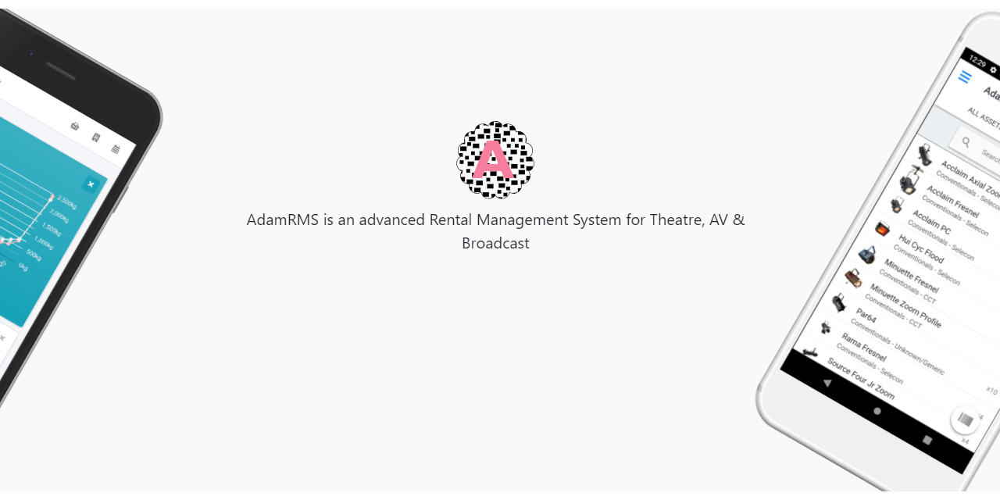

# AdamRMS

AdamRMS is an advanced Rental Management System for Theatre, AV & Broadcast, written in PHP with the Twig Templating engine, and deployed using a pre-built docker container.

It is available as a hosted solution (not currently open to new customers) or to be self-hosted as a docker container. 

## Repositories

 - [*This repo* Project Source Code __adam-rms__](https://github.com/bstudios/adam-rms)
 - [Mobile App __adam-rms-app__](https://github.com/bstudios/adam-rms-app)
 - [Deployment Script Templates __adam-rms-deployment__](https://github.com/bstudios/adam-rms-deployment)
 - [Image Compressor Worker __adam-rms-imageCompressor__](https://github.com/bstudios/adam-rms-imageCompressor)
 - [File Deleter Worker __adam-rms-s3Deletor__](https://github.com/bstudios/adam-rms-s3Deletor)
 - [Public Marketing Site __adam-rms-website__](https://github.com/bstudios/adam-rms-website)

## Docker Images

 - Docker Hub: [bithellstudios/adam-rms](https://hub.docker.com/r/bithellstudios/adam-rms)
 - GitHub Packages: [bstudios/adam-rms](https://github.com/orgs/bstudios/packages?repo_name=adam-rms-app)

## Deploying & Using

*To be developed further in the future*

## Contributing 

Contributions are very welcome - please see [CONTRIBUTING.md](CONTRIBUTING.md) for a guide, or feel free to open a [Discussion](https://github.com/bstudios/adam-rms/discussions)

## Licence

AdamRMS is a web-based Rental Management System

Copyright (C) 2019-2021 Bithell Studios Ltd.

This program is free software: you can redistribute it and/or modify
it under the terms of the GNU Affero General Public License as published
by the Free Software Foundation, either version 3 of the License, or
(at your option) any later version.

This program is distributed in the hope that it will be useful,
but WITHOUT ANY WARRANTY; without even the implied warranty of
MERCHANTABILITY or FITNESS FOR A PARTICULAR PURPOSE.  See the
GNU Affero General Public License for more details.

You should have received a copy of the GNU Affero General Public License
along with this program.  If not, see <https://www.gnu.org/licenses/>.
