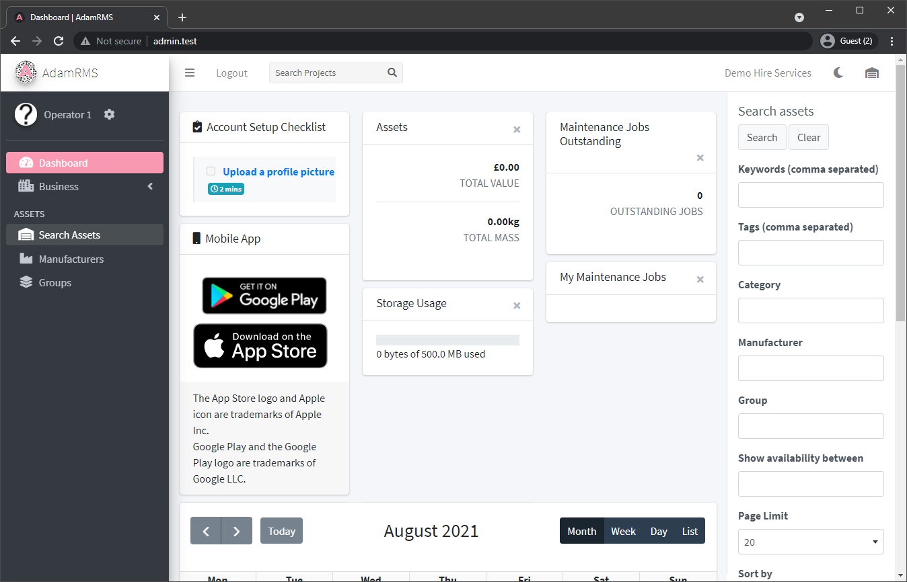
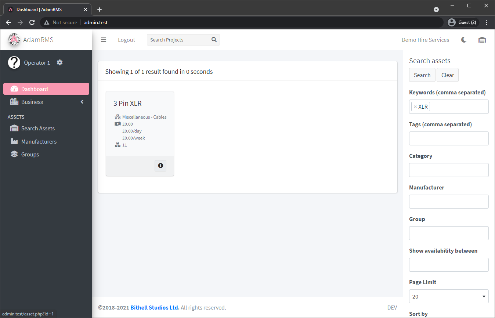
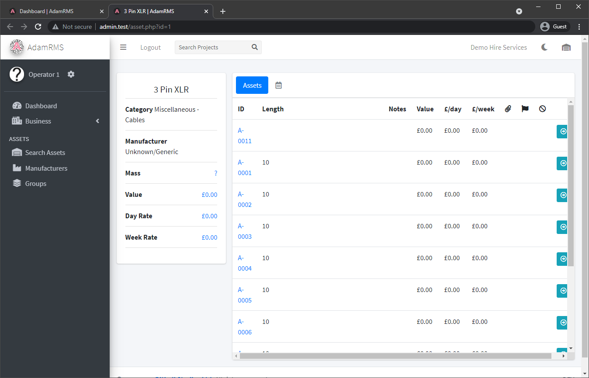
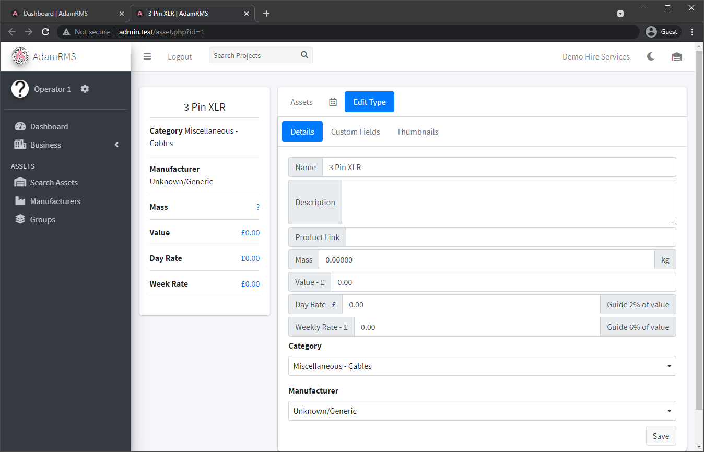
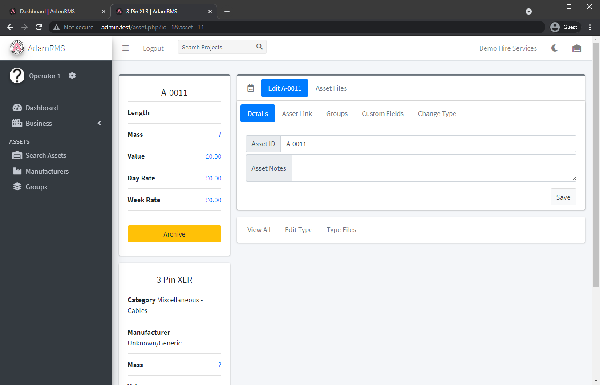

# Finding assets

AdamRMS uses a comprehensive search system to help you find assets. You can open the search engine from any page by clicking on the warehouse button on the top menu bar.

*Asset Search*

You can search by:
- Keyword - Name of asset (eg. Source 4 Jr)
- Tags - Asset ID (A-XXXX) or custom barcode value (eg T-3214)
- Category - eg. ‘Lighting - Conventionals’
- Manufacturer - eg. ‘ETC’
- Group - Business asset group

Asset availability can be checked by:
- Date range (“Show availability between”)
- Project

Page Limit, Sorting, Linked Assets and Archived assets are additional options if you need further control over searching.  
From the search page, you can also export a full list of assets in either .xlsx or .csv formats.

## Listing Assets
---
Once you’ve searched for some assets, they’ll be listed in pages.  
Each asset type has an add-to-project option, which allows you to add any assets that can be added to the project.  
You can also view more information about an asset by clicking on it!  

*Example Listing of assets, based on the "XLR" keyword*

## Viewing Assets
---
Asset pages initially show the general Asset Type, which contains information about the asset as a whole. This includes a calendar that shows all asset assignments, and a list of all assets of that asset type

*Example Asset Type page*

## Asset Type Files
---
Asset types can have files stored with them.

:::note Asset Files Permissions  
54 - View Asset Type File Attachments  
55 - Upload Asset Type File Attachments  
:::  

For asset types it is suggested the files are for user manuals, info sheets and more general documentation.   
More information about files on AdamRMS can be found [here](../Development/development#files-on-adamrms)

### Editing asset types
---
Asset types can be altered to add additional information, Custom fields and asset thumbnails.

:::note Editing Asset type permissions  
18 - Create new Asset Type  
58 - Edit Asset Type
::: 

 
*Editing XLR asset type* 

Custom Fields are additional information about an asset that can be defined on an asset type basis. For example, you may use them to record the lengths of different XLR cables. To do this, the XLR asset type should have a Custom Field called Length, which can be assigned for each asset.  
All asset types can have multiple thumbnails which can be uploaded in this section.  

:::caution
If you are unable to edit an asset, it may be a built-in asset. Contact AdamRMS support to make changes to these assets.
:::

### Individual Assets
---
From the assets list, an individual asset can be viewed. The individual asset holds more information about the single object.

*Editing an individual XLR asset*

Assets can be linked to other assets, so that those assets are assigned to a project when the main asset is assigned.  
You can assign assets to a group from the group tab.  
Individual assets can have associated files, usually used for invoices.  
Assets can be assigned barcodes, which can be scanned in the AdamRMS App.  
[Asset Maintenance](./maintenance) can be managed in the individual asset page.
