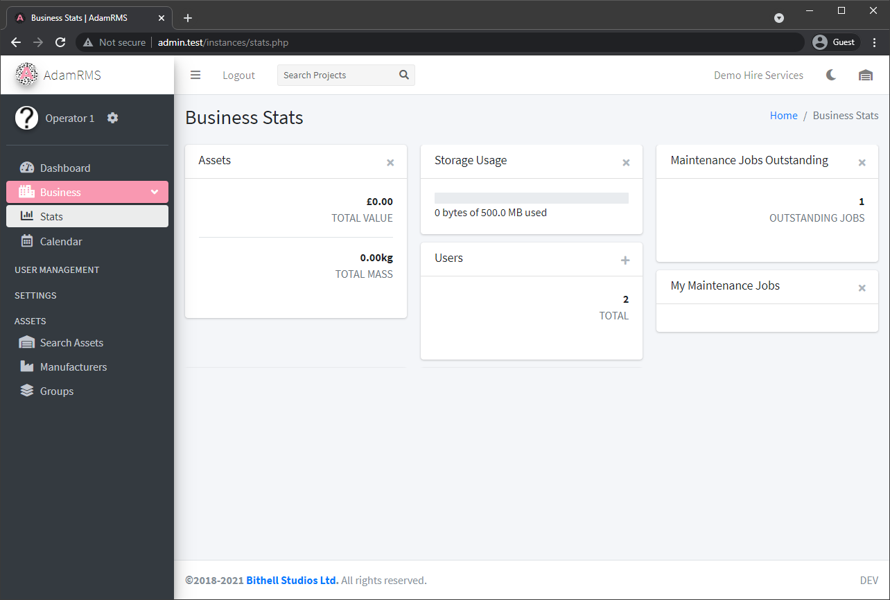
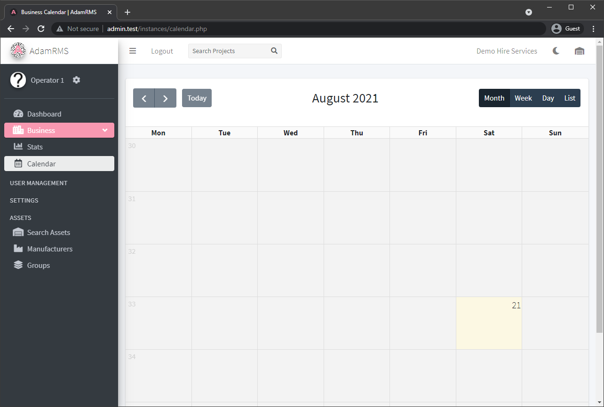
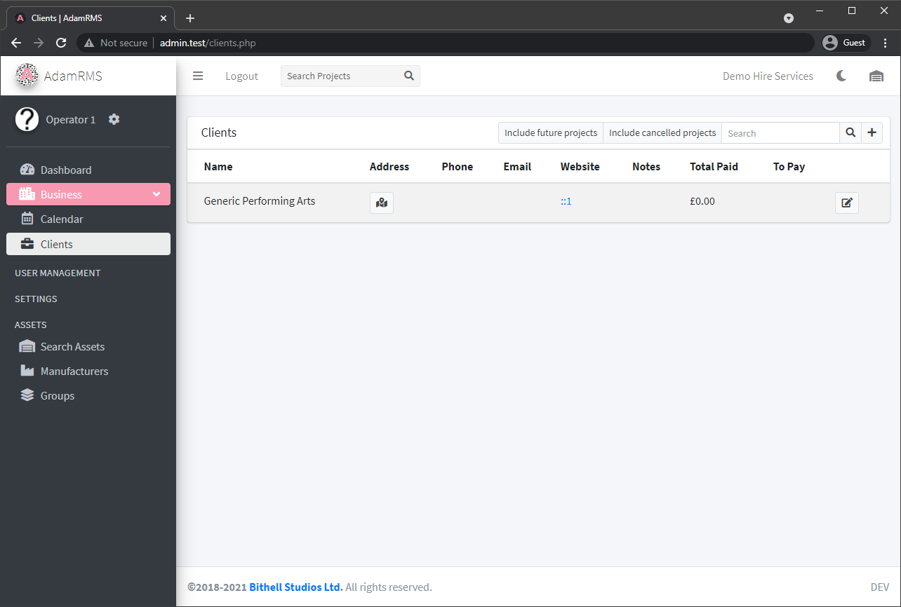
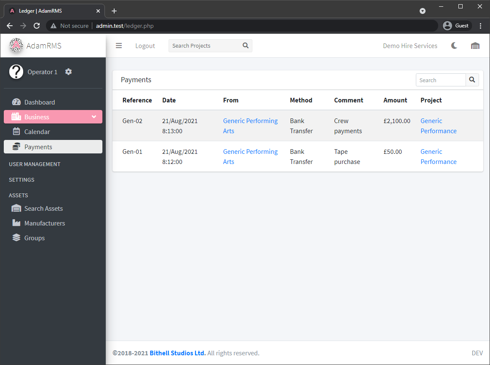
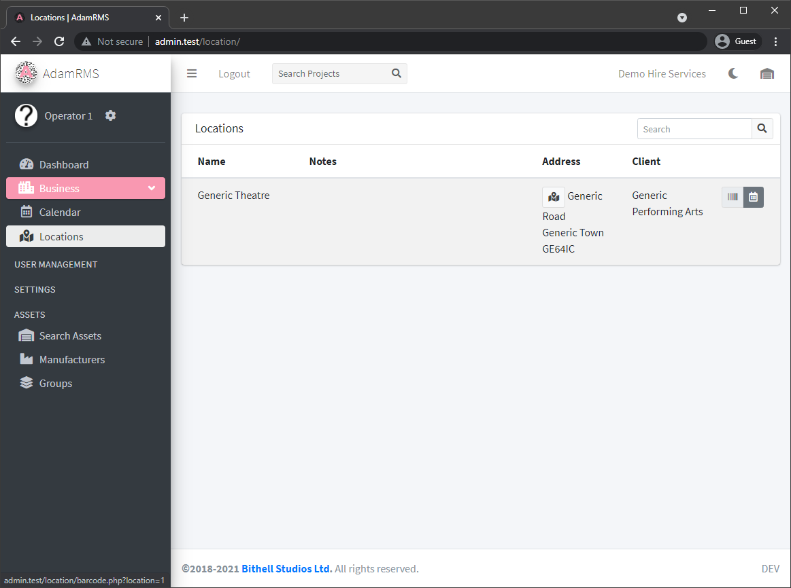
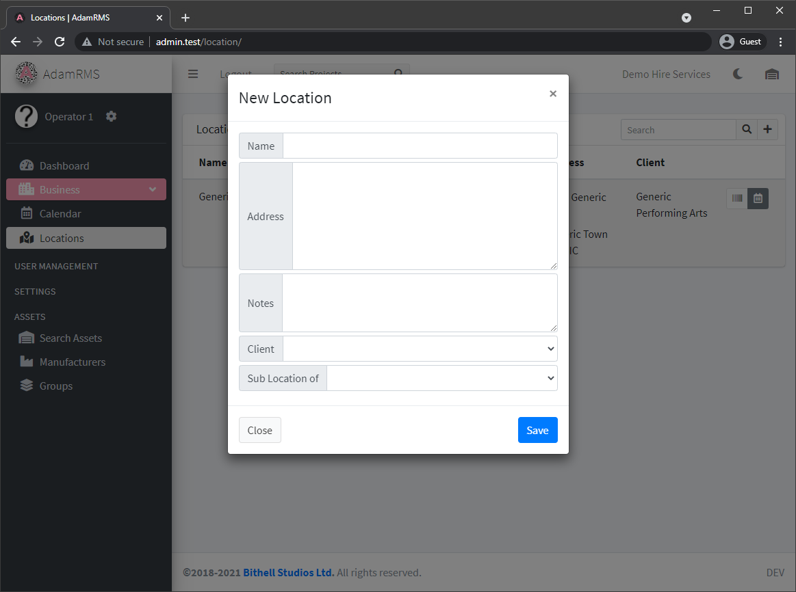

# Business Utilities

## Stats
---
Business stats are widgets that appear on a user’s dashboard, that give information about the business and a user’s tasks on the RMS.  
The stats page allows users to add and remove widgets from their dashboard.

:::note Stats Permissions  
80 - View business stats  
:::

*Business Stats Widgets*

## Calendar
---
The Business Calendar shows an overview of all projects that are currently not archived or deleted.  
It is repeated on the main Dashboard page.

*Business Calendar*

## Clients
---
The Clients page lists all business clients, and is where new ones are added.
There are a number of fields about each client, which includes the total amount paid to your business and how much is owed by the client

:::note Client Permissions  
36 - View Clients List  
37 - Add new Client  
39 - Edit Client  
:::

*Client List*

A new client just needs a Name, other entries can then be added by editing the client.

Clients can have the following fields:
- Name
- Address
- Phone Number
- Email
- Website
- Notes - General comments about this client

## Payments
---
The Payment page is your business ledger, which tracks all payments added to the RMS.

:::note Payment Permissions  
40 - View Ledger  
:::

*List of Payments*

## Locations
---
[Projects](../Projects/projects) and [Assets](../Assets/assets) can be assigned a location to say where they are.

*List of Locations*

:::note Location Permissions  
87 - View a list of locations  
98 - Add a new location  
99 - Edit a location  
103 - View location barcodes  
::: 

Locations consist of:
- Name
- Address
- Notes (eg. Access requirements)
- Client - Link a location to a client
- Sub Location Of - Add a hierarchical list of locations.

*Adding a new location*

Each location has an AdamRMS barcode that is used by the [AdamRMS App](../AdamRMS%20App/adam-rms-app). These can be printed to place in the location or accessed from the website to assign assets to a location.
