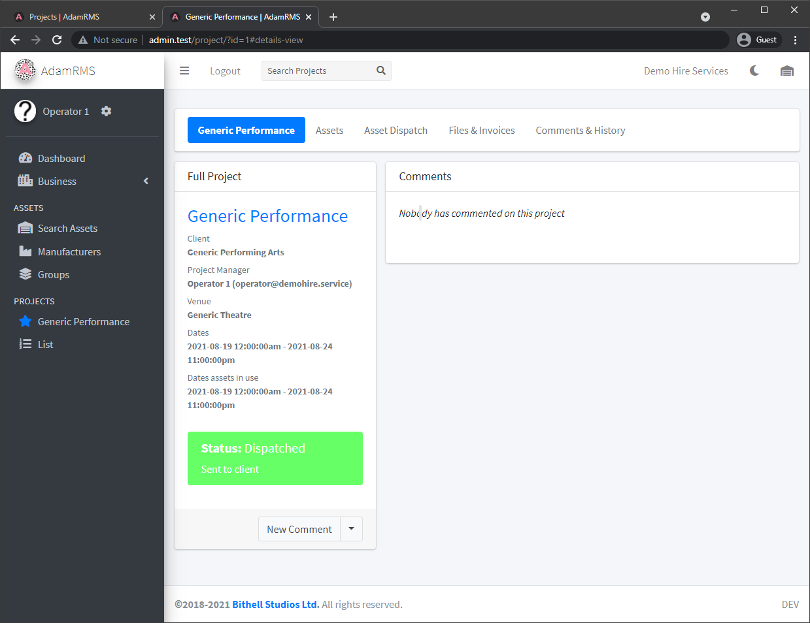
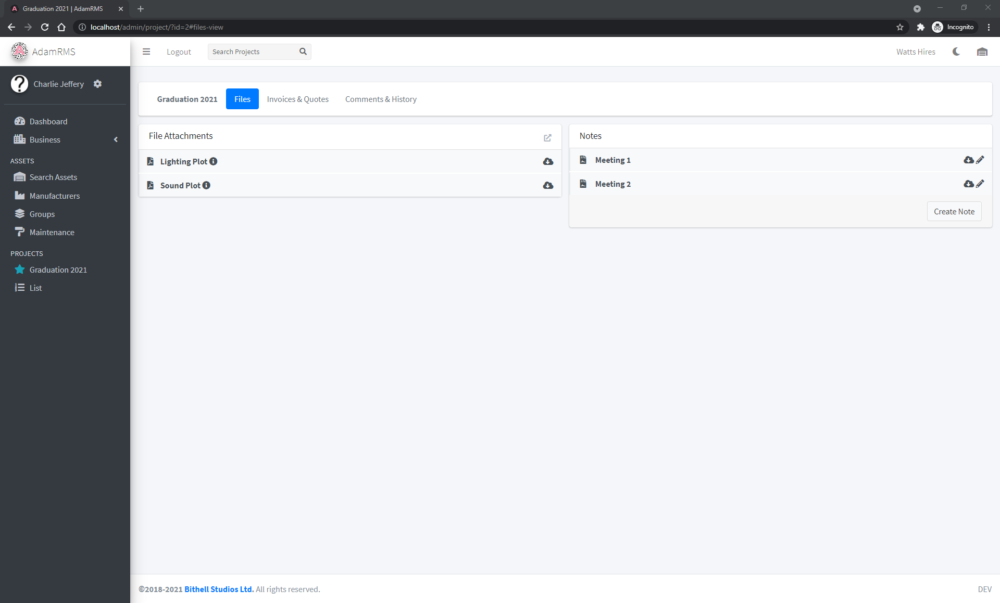
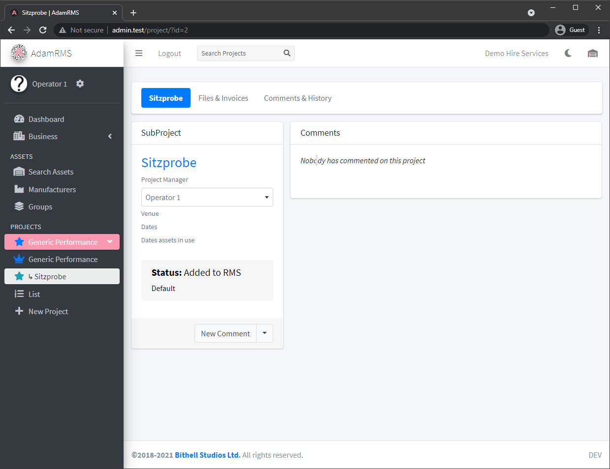

# Project Overview
---

The project overview page lists basic information about the project, along with any comments.

:::note Edit Permissions
22 - Change Project Client  
23 - Change Project Lead  
24 - Change Project Description  
7 - Change Project Dates
28 - Change Project Name  
29 - Change Project Status  
30 - Change Project Address  
:::

All projects can consist of:
- A Client
- A Project Manager
- A Venue
- Project Dates, including asset dispatch dates

*Project Overview*

Comments allow you to keep a log of updates about the project, such as venue and date  changes.

All Projects have a status, that is the overall status of the project. You can also have statuses for each asset in the project, which is discussed in the next section.

## Comments & History
---

AdamRMS has a full Audit Log, which keeps track of changes to various elements of the platform. This includes projects, and the edit history of the project can be found on the history page.

*Project History*

## Files & Invoices
---
Projects can have files and notes associated with them, to keep track of various elements.

:::note File Permissions  
44 - Edit Project Notes  
45 - Add Project Notes  
102 - Upload Project Files  
:::

*Notes and Projects for the project*

Notes are intended to be used for meeting notes and event plans.

## Sub-projects
---
Projects can have associated sub-projects, which are linked to the main project. These sub-projects act as independent projects, but are linked for organisation.

*An example subproject*

It is recommended you set up a new Project Type for sub-projects that excludes Finance, so that financial elements are only included in the main project.

*Suggested subproject type*
