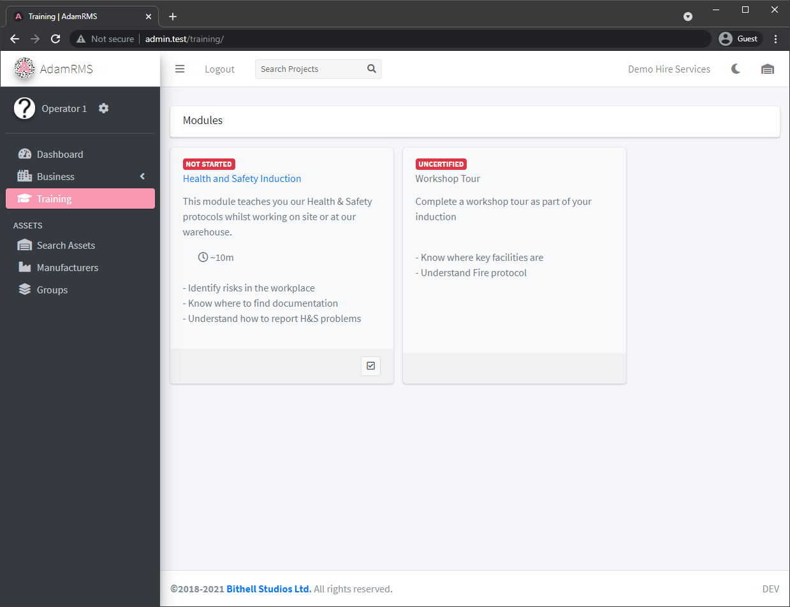
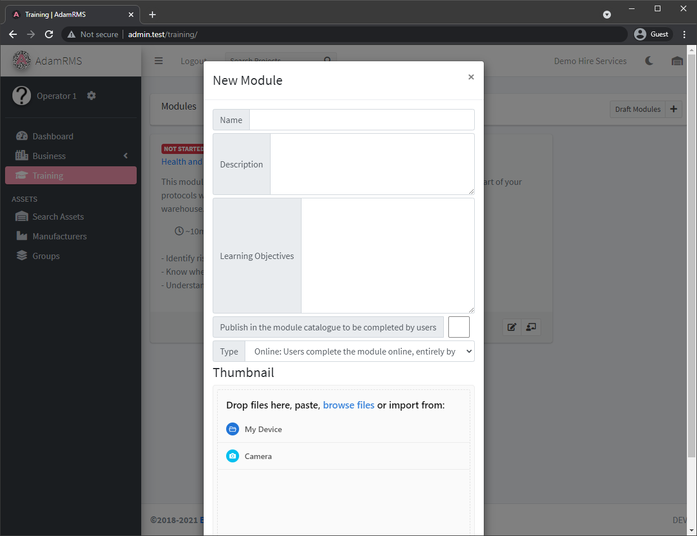
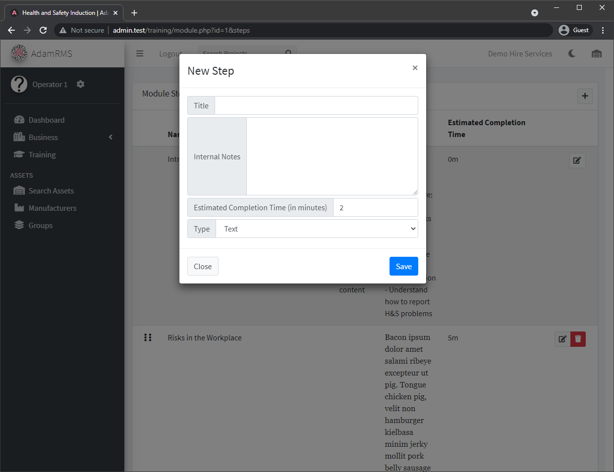
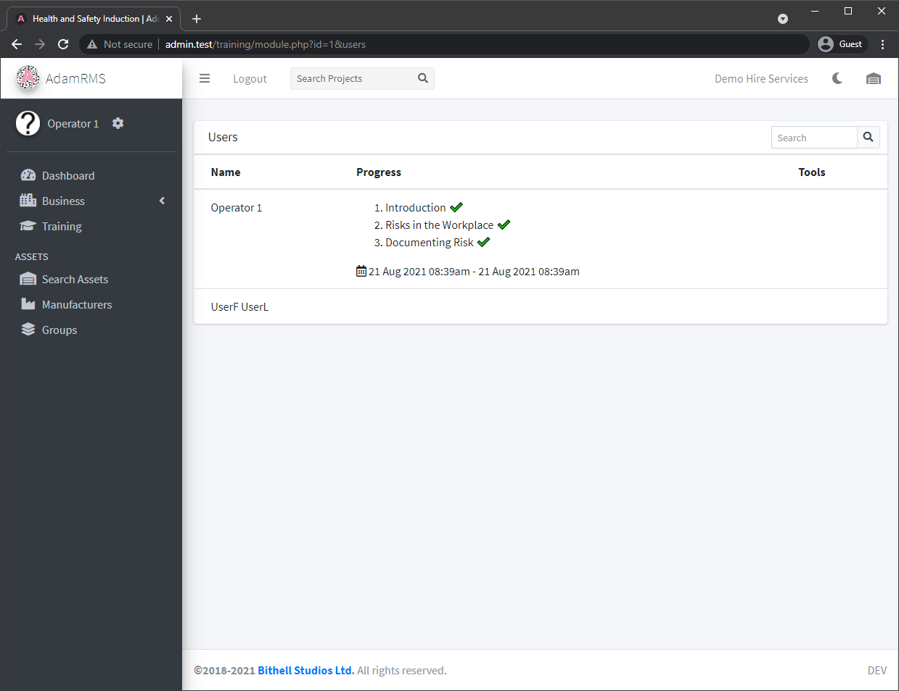
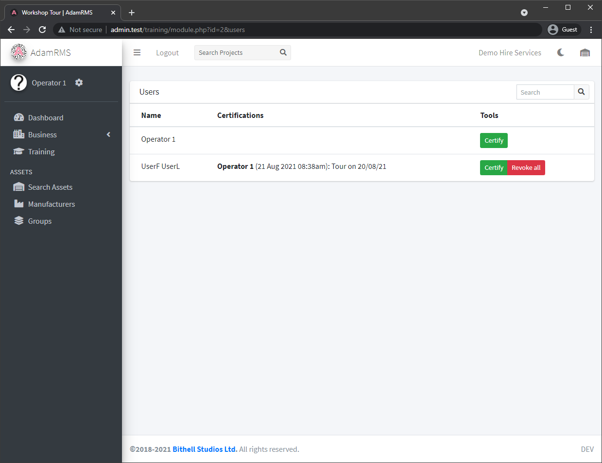

# Training

AdamRMS provides a platform to create training modules for business members.  
Modules can be entirely online, entirely in person, or a hybrid of both.

:::note Training Permissions  
113 - Access Training  	
114	- View draft training modules  
115	- Add Training module  
116	- Edit Training modules  
117	- View a list of users that have completed a training module  
119	- Certify a user's training  
120	- Revoke a user's training  
:::

*List of training modules*

## Creating Modules
---

Training is split into modules that users can complete at their own pace.

A module contains the following basic information:
- Module Name
- Description
- Learning Objectives
- Draft Status
- Training Type:
    - Online: Users complete the module online, entirely by themselves
    - Hybrid: Users complete the module online, and are then certified by an administrator
    - Physical: Users cannot complete the module themselves - they are certified by an administrator
- Module Thumbnail

*Create a new Training module*

## Module Steps
---
Each Online or Hybrid module can have as many steps as required to cover relevant content.  
AdamRMS creates an Introduction step that covers the learning objectives for the module. You can then add more steps.

Each step contains the following information:
- Step Title
- Internal notes (eg. content to be changed)
- Estimated completion time
- Step type
    - Text based - uses the standard RMS text editor
    - Custom HTML (coming soon)
    - Youtube video - provide a link to a non-private youtube video
- Step published status

*Creating a new training step*

Once a step is published users can view and mark training as complete. You can view user progress on a module on the module users page, including a timestamp for start and finish for the module.

*Users who have completed the module*

## Module Certification
---

Physical modules work slightly differently, and require administrators to mark the module complete on a user by user basis. Physical modules can also have module steps

To certify a user, head to the module’s user page, find the user and certify them. You must give a comment about certification, and then this is recorded with the certifying user and a timestamp of certification.

*Certifying a physical training module*
